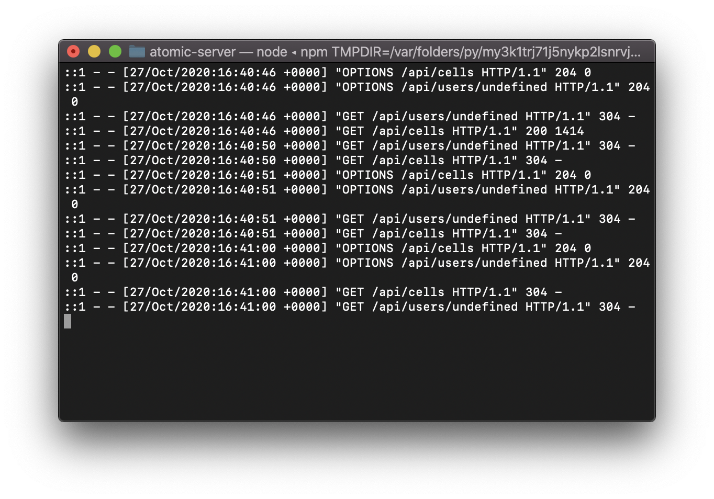

# Atomic (Server)

<a href="https://atomic.joshuaakanetuk.com" title="Atomic (Server)">
  
</a>
 <p align="center"><a href="https://atomic.joshuaakanetuk.com">Live App</a><br><br>📜 Keep a running log of your activities and feelings!<br>For data junkies and folks looking to make changes in their life.<br><br><i>"You can't manage what you can't measure." — Peter Drucker</i></p>


## Motivation

Inspired by Productive, Daylio, and countless other apps telling me what to do instead of measuring what I routinely do already. 

<br>

## Features

- Sign up.
- Customize your profile image.
- Create cells (feeling and activity logs) for your day.
- Get a summary of your feelings and activities. 
- Responsive design.

<br>

## Tech Stack

- HTML
- CSS
- Javascript
- React
- PostgreSQL
- Express

<br>

## Installation & Development


### Postgres

If you don't already have a postgres on your computer follow instructions here.

- [Install Postgres](https://www.postgresql.org/download/)
- Run server with (macOS & Linux) `pg_ctl -D /usr/local/var/postgres start` or (Windows) `psql`
- Then create `postgres` user in terminal or cmd with `createuser -Pw --interactive `
- Then run `createdb -U postgres atomic`

Potentially more in depth instructions:

[MacOS & Ubuntu](https://www.digitalocean.com/community/tutorials/how-to-install-postgresql-on-ubuntu-20-04-quickstart)

[Windows](https://www.postgresql.org/download/windows/)

> The installer is designed to be a straightforward, fast way to get up and running with PostgreSQL on Windows.

<br>

### Application

You'll need run this before [`atomic`](https://github.com/joshuaakanetuk/atomic) in order for the application to work completely.

- Clone from [`https://github.com/joshuaakanetuk/atomic-server`](https://github.com/joshuaakanetuk/atomic-server)
- `cd` into `atomic-server`
- Run `npm i`
- Run `npm run startdev` to create tables and seed.
- Run `npm run dev` and then run client!

<br>

## API Documentation

All required variables are included in each request.

### Cells Endpoints

### ▸ `GET /api/cells`

Returns an array of cells you have created.

**Example Response**

```
[
    {
        "id": "7b6ef2b3-7785-40f3-989f-e49f66017f6f",
        "type": "do",
        "date_created": "2020-10-25T03:22:55.825Z",
        "verb": "ate",
        "unit": "minutes",
        "forBool": true,
        "number": "3",
        "user_id": 2,
        "comment": ""
    },
    ...
]
```

### ▸ `POST /api/cells`

Posting to the endpoint creates a cell.

**Example Request**

```
{
    "type": "do",
    "verb": "created",
    "unit": "cell",
    "forBool": true,
    "number": "1",
    "user_id": 1,
    "comment": "New cell time!"
}
```

**Example Response**

Endpoint returns 201 and request on success.

### ▸ `GET /api/cells/:cellId`

Returns cell in object form.

**Example Response**

```
{
    "id": "0f8bbe4b-e2c5-4a3b-89b7-f85d79149851",
    "type": "do",
    "date_created": "2020-10-27T16:28:46.228Z",
    "verb": "created",
    "unit": "cell",
    "forBool": true,
    "number": "1",
    "user_id": 2,
    "comment": "New cell time!"
}
```

### ▸ `PATCH /api/cells/:cellId`

Allows edits to existing cells.

**Example Request**

```
{
    "type": "do",
    "verb": "updated",
    "unit": "cell",
    "number": "1",
    "comment": "Updated cell time!"
}
```

**Example Response**

```
{
    "id": "0f8bbe4b-e2c5-4a3b-89b7-f85d79149851",
    "type": "do",
    "date_created": "2020-10-27T16:28:46.228Z",
    "verb": "updated",
    "unit": "cell",
    "forBool": true,
    "number": "1",
    "user_id": 2,
    "comment": "Updated cell time!"
}
```

### User Endpoints


### ▸ `GET /api/users/`

Returns user in object form. Must be logged in.

**Example Response**

```
{
    "full_name": "Joshua Akan-Etuk",
    "profile_image": ""
}
```

### ▸ `POST /api/users`

Allows you to create a new user. Returns user object.

**Example Request**

```
{
    "full_name": "I'm Client",
    "user_name": "client",
    "password":"PASSWORDHERE"
}
```

**Example Response**

```
{
    "id": 3,
    "full_name": "I'm Client",
    "user_name": "client",
    "type": "user",
    "profile_image": "https://place-hold.it/300",
    "date_created": "2020-10-27T16:32:27.189Z"
}
```


### Auth Endpoints

### ▸ `POST /api/login`

Allows you to login into server.

**Example Request**

```
{
    "user_name":"admin",
    "password": "passwOrd1@"
}
```

**Example Response**

```
{
    "user": { "..."
    },
    "authToken": "..."
}
```

## Copyright

Copyright 2020, Joshua Akan-Etuk.

<br>

<p align="center"><a href="https://joshuaakanetuk.com" title="Joshua Akan-Etuk">
  
</a></p>